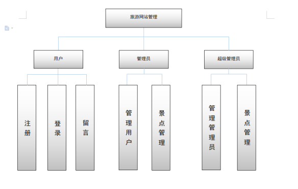
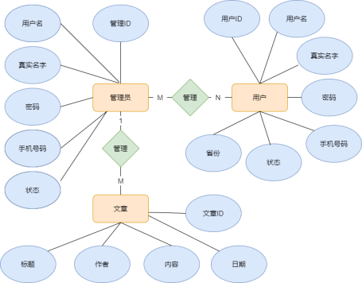
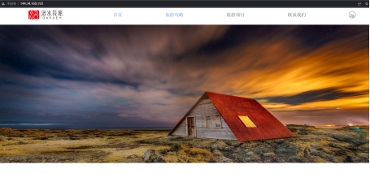
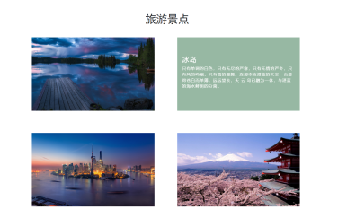
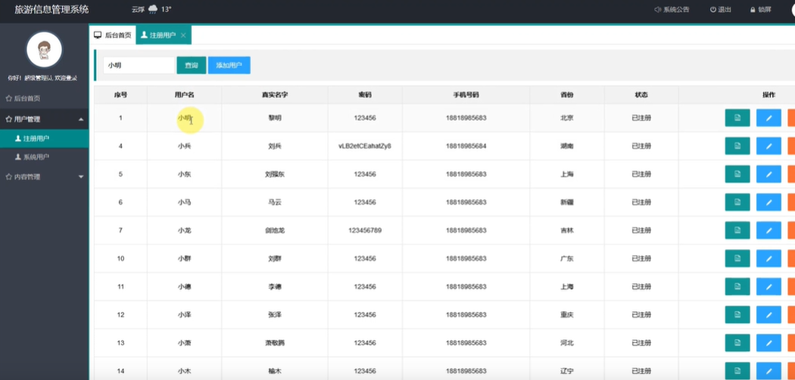
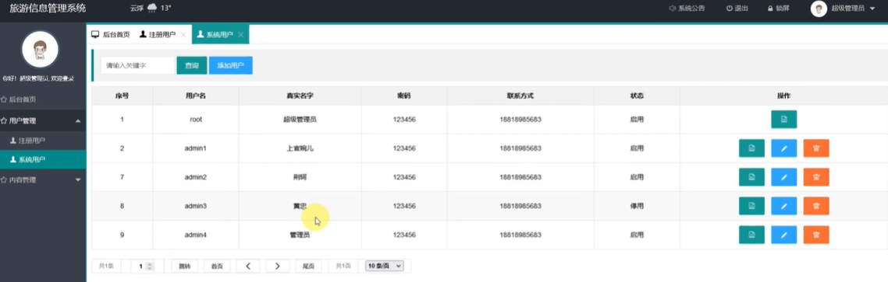

# 简介
本网站是根据旅游行业的这种现状,提出解决问题的一个可行性方法：采用spring boot+mybatisPlus技术，
实现了旅游信息的系统管理，各类信息有序地进行存储，可进入系统主控界面，进行信息管理，信息查询，等功能的使用。
实现了各种业务系统的数据集成和信息集成，对旅游各类信息、资源进行协同集中管理。

**开发环境**

系统环境：Windows

开发工具：IDEA

Java版本：JDK 1.8

服务器：tomcat 8.5

数据库：MySQL 5.7

系统采用技术：soringboot+mybatisplus+layui+thymeleaf


```java
运行项目必看：
1，导入sql文件
2，修改application.properties的数据库用户名和密码
启动项目
后台登录账户密码
root,123456
```








# 延伸阅读

